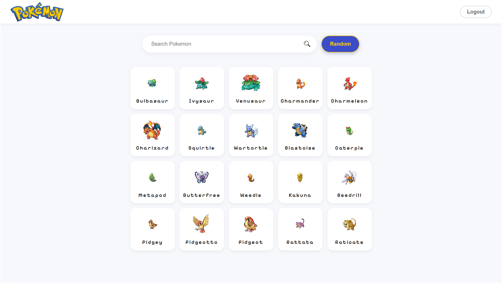
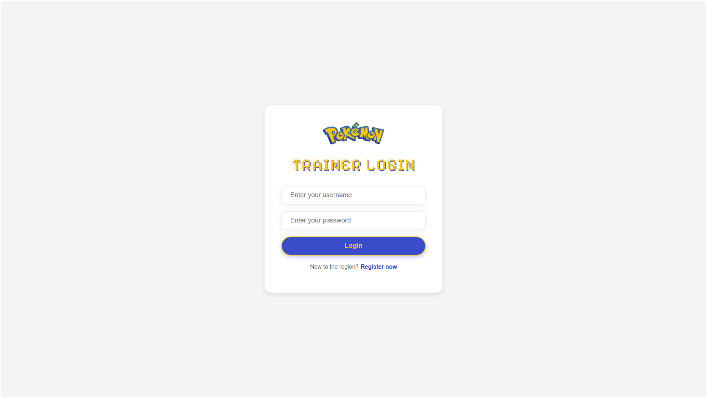
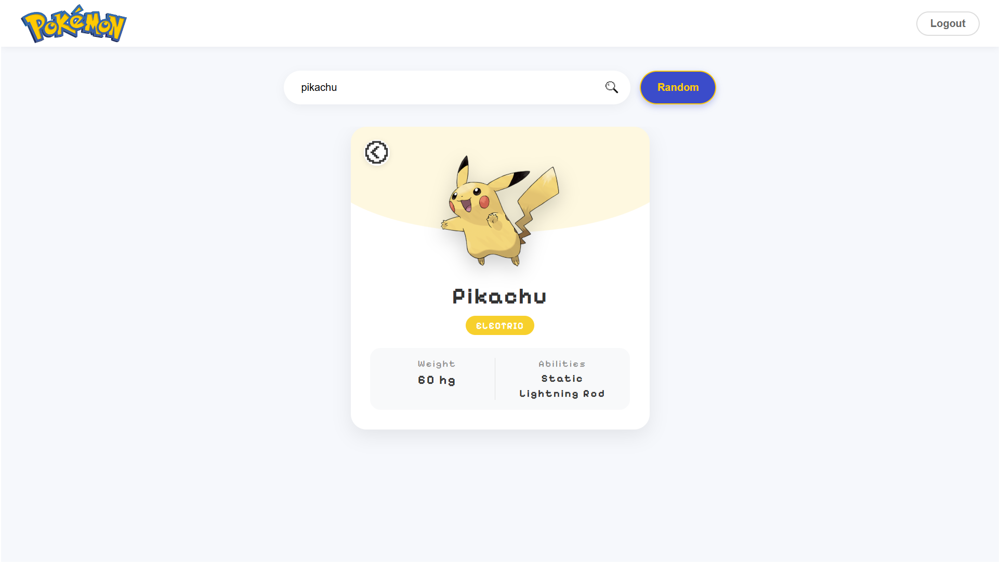

# 🎮 Pokémon Pokedex Web Application

แอปพลิเคชันค้นหาและแสดงข้อมูลโปเกมอนที่พัฒนาด้วย **React** + **TypeScript** มาพร้อมกับระบบ Authentication แบบ JWT โดยแบ่งแยกโครงสร้างโค้ดแบบ Clean Architecture ตามหลัก **SRP (Single Responsibility Principle)** และ **KISS (Keep It Simple, Stupid)**



---

## ✨ พรีวิวหน้าอื่นๆ

<div align="center">
  
  
  
</div>

---

## 🚀 ฟีเจอร์หลัก
* **Authentication:** ระบบ Login และ Register ผ่านระบบ JWT Protected Routes
* **Auto-Fetch Initial List:** แสดงผลตะกรก้าโปเกมอนเริ่มต้น (Initial Grid List) ในทันทีที่เข้าหน้าเว็บ
* **Dynamic Search Form:** ค้นหาโปเกมอนตามชื่อได้อย่างรวดเร็ว
* **Pokemon Card & Details:** แสดงข้อมูลสำคัญ เช่น รูปร่าง, น้ำหนัก, ความสามารถหลัก, และแสดงสีพื้นหลังอิงตาม Type ของโปเกมอนแต่ละตัว
* **Random System:** ระบบสุ่มโปเกมอนแบบสุ่ม!
* **UX/UI Interactive State:** 
  * Animated Input Forms
  * Hover Grid Floating Status
  * Pokemon Card Skeleton Loaders
  * Interactive Back Buttons

---

## 🛠️ ระบบ Environment Variables ปรับแต่งตั้งค่า (.env)

แนะนำให้สร้างไฟล์ `.env` ที่ root ของโปรเจกต์ฝั่งหน้าบ้านก่อนเริ่มรันโปรเจกต์ เพื่อความสะดวกต่อระบบ

```env
# ยกตัวอย่างไฟล์ .env ของฝั่ง Frontend
VITE_API_URL=http://localhost:3000
```
> **หมายเหตุ:** โปรเจกต์มีการเรียก Backend ไปที่ API Gateway `http://localhost:3000` สามารถแก้ไข baseURL หากเปลี่ยน Port ทางฝั่ง Backend ผ่านไฟล์ `src/hooks/usePokemon.ts` หรือ `src/hooks/useAuth.ts`

---

## ⚙️ วิธีติดตั้งและการใช้งาน (How to run)

1. ทำการ Clone โปรเจคนี้มายังเครื่องของคุณ
2. เข้าสู่โฟลเดอร์ฝั่งหน้าบ้าน (`pokemon-fe`)
3. ตรวจสอบให้แน่ใจว่าได้ทำการ Start Server ของฝั่ง Backend ไว้อยู่แล้ว

```bash
# 1. ติดตั้ง Dependencies พื้นฐาน
npm install

# 2. รันแอปพลิเคชันในโหมดนักพัฒนา (Development Server)
npm run dev
```

หลังจากนั้นสามารถเปิดเว็บบราวเซอร์ของคุณไปที่พอร์ตเริ่มต้นที่ระบบเปิด เช่น `http://localhost:5173/` !

---

## 📦 โครงสร้างการแยกส่วนที่สำคัญ (Component Refactoring)

โปรเจกต์ชุดนี้ผ่านกระบวนการทำ **Refactoring** จัดแยก `PokemonPage.tsx` ออกตามสถาปัตยกรรมที่ถูกต้อง:

* **`/components/ui/`**: เก็บ `Input.tsx` และ `Button.tsx` (Global UI Components สามารถเรียกใช้ซ้ำได้)
* **`/components/PokemonCard.tsx`**: ทำหน้าที่แสดงผลข้อมูลในตัวการ์ดและการผูกสี Background Dynamic (SRP)
* **`/components/PokemonList.tsx`**: ทำหน้าที่แสดงผล Grid อัจฉริยะแบบเลื่อนสกอร์ของรายชื่อแบบเริ่มต้น
* **`/components/PokemonSearchForm.tsx`**: ฟอร์มค้นหาที่มีการแยกสเตตและแอนิเมชันขยับขึ้นลง (SRP)
* **`/components/PokemonSkeleton.tsx`**: ชุด UI จำลองตอนระหว่างรอ Backend ตอบกลับ (Loading State)

---
*Created carefully as an advanced UI/UX responsive Pokemon solution.*
